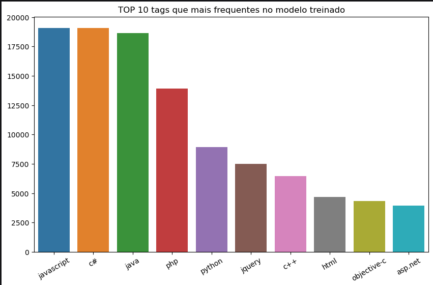

# Atividade avaliativa final — Tópicos especiais em business inteligence e analytics 3

## Introdução

Neste notebook, apresentamos o uso de Machine Learning com Regressão Logística e `Processamento de Linguagem Natural (PLN)`, o nosso objetivo é a previsão das tags das tecnologias e linguagens de programação com base em perguntas mais frequentes criadas em sites de dúvidas sobre Tecnologia da Informação.

Criamos gráficos trazendo as top 10 pavras mais frequentes no modelo e outro gráfico com as tops 10 tags mais utilizados no modelo treinado.

## Tópicos 

- Estudo de caso
- Importando bibliotecas
- Intlaando dependências
- Importando o conjunto de dados
- Preparação do texto
- Contando as palavras
- Avaliação
- Conclusão (falta fazer)
- Referências (falta fazer)

# Geraçaão de Gráfico de Tags



Utilizamos a função: "```tags_list = list(dict(tags_freq[:10]).keys())```" para gerar um gráfico que contém as 10 tags mais frequentes em nosso Data Set.